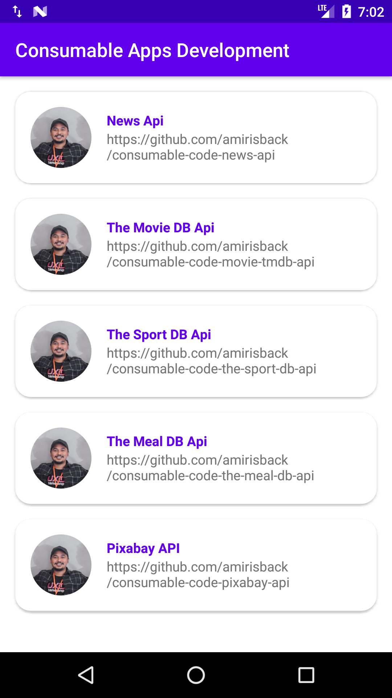
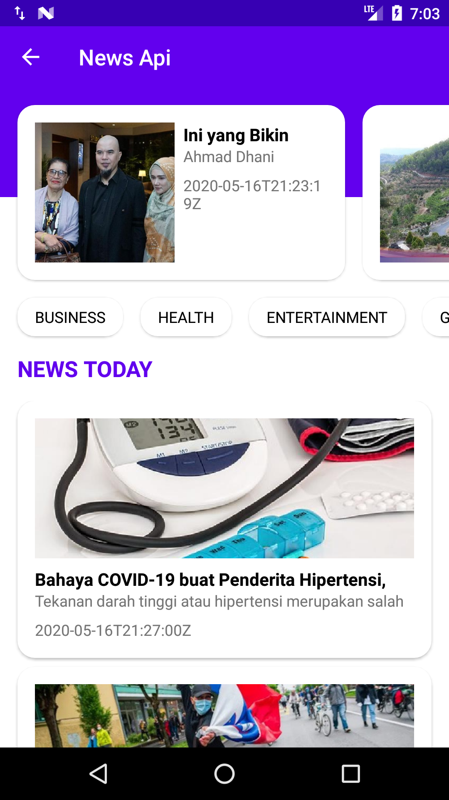
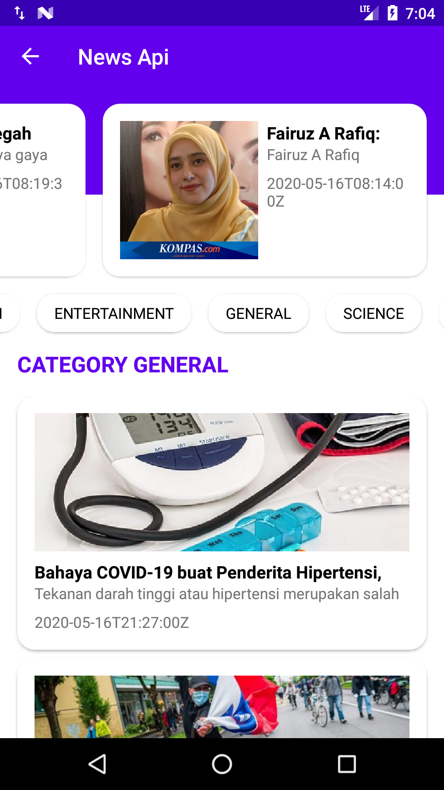
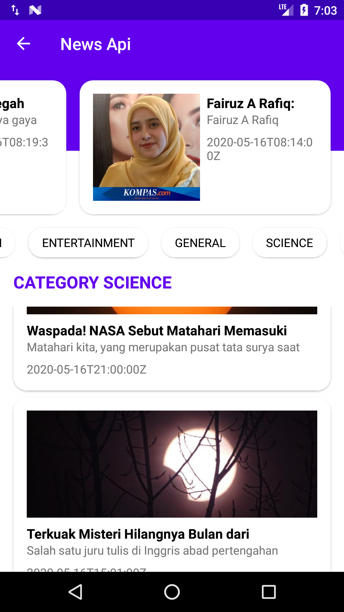
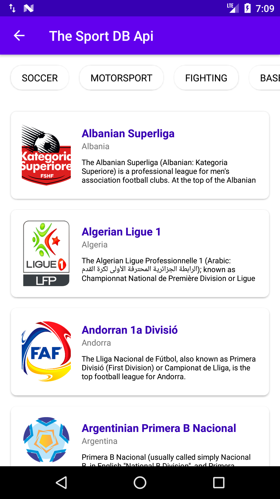
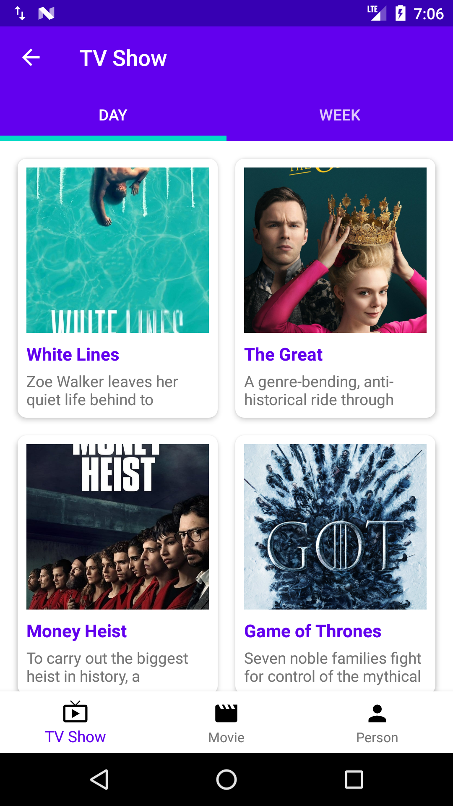
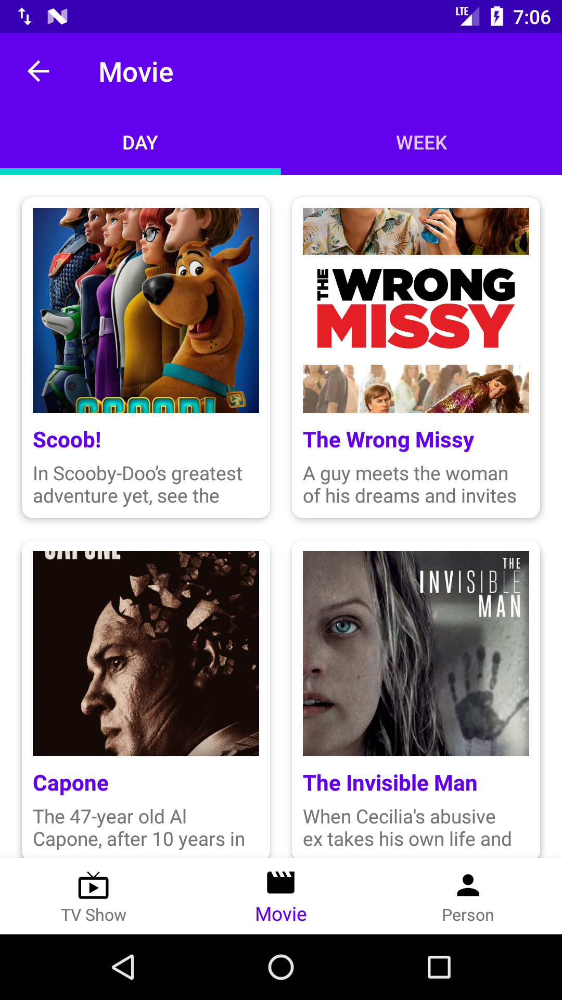
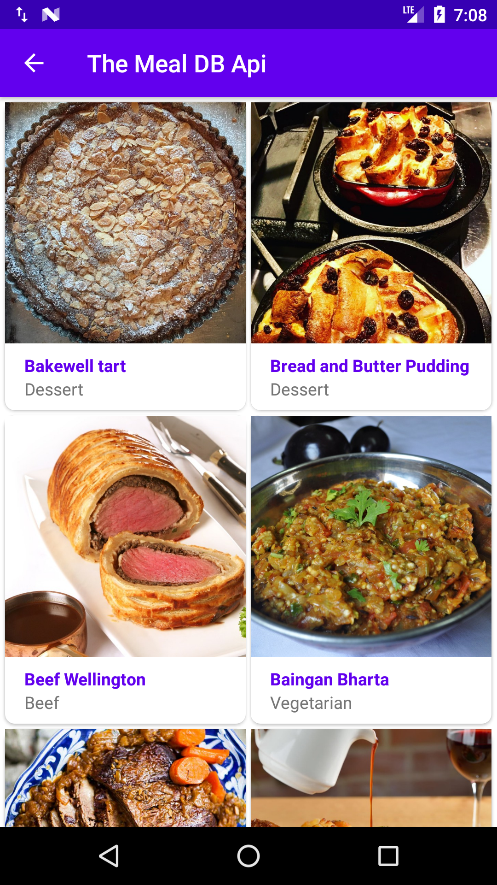
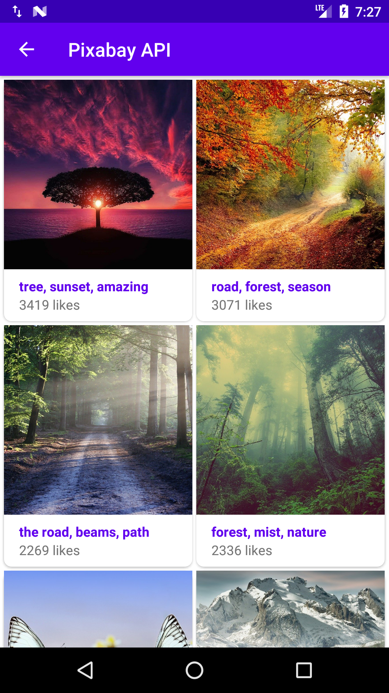

## Consumable Apps By AmirIsBack
- v2.0.0 - Development
- Stable Version

## About This Project
UI Apps, no need to worry about the data, because it's been handled with a library

## Special From This Project
Beautiful ui no more fethcing data, focus on ui

## Using Library
| No | Name       | Language    |Type    | Link                               |
|----|------------|-------------|--------|------------------------------------|
| 1. | frogo-recycler-view | Java/Kotlin | UI/Widget | https://github.com/amirisback/frogo-recycler-view  |
| 2. | frogo-admob-helper | Java/Kotlin | Util | https://github.com/amirisback/frogo-admob-helper |

## Consumable Library Index
| No | Name       | Language    |Type    | Link                               |
|----|------------|-------------|--------|------------------------------------|
| 1. | consumable-code-news-api | Java/Kotlin | Data | https://github.com/amirisback/consumable-code-news-api |
| 2. | consumable-code-the-sport-db-api | Java/Kotlin | Data | https://github.com/amirisback/consumable-code-the-sport-db-api |
| 3. | consumable-code-movie-tmdb-api | Java/Kotlin | Data | https://github.com/amirisback/consumable-code-movie-tmdb-api |
| 4. | consumable-code-pixabay-api | Java/Kotlin | Data | https://github.com/amirisback/consumable-code-pixabay-api |
| 5. | consumable-code-the-meal-db-api | Java/Kotlin | Data | https://github.com/amirisback/consumable-code-the-meal-db-api |
| 6. | consumable-code-the-cocktail-db-api| Java/Kotlin | Data | https://github.com/amirisback/consumable-code-the-cocktail-db-api |
| 7. | consumable-code-covid-19-api| Java/Kotlin | Data | https://github.com/amirisback/consumable-code-covid-19-api |

## Automatically Using This Permission
    
    <uses-permission android:name="android.permission.INTERNET"/>
    <uses-permission android:name="android.permission.ACCESS_NETWORK_STATE" />

## Version Release
This Is Latest Release

    $version_release = Development mode

What's New??

    * Development *

## Screen Shot Apps
### Main Apps

### News API

### The Sport DB API

### The Movie DB API

### The Meal DB API

### Pixabay API

## Colaborator
Very open to anyone, I'll write your name under this, please contribute by sending an email to me

- Mail To faisalamircs@gmail.com
- Subject : Github _ [Github-Username-Account] _ [Language] _ [Repository-Name]
- Example : Github_amirisback_kotlin_admob-helper-implementation

Name Of Contribute
- Muhammad Faisal Amir
- Waiting List
- Waiting List

Waiting for your contribute

## Attention !!!
Please enjoy and don't forget fork and give a star
- Don't Forget Follow My Github Account
- If you like this library, please help me / you can donate to buy patreon services
